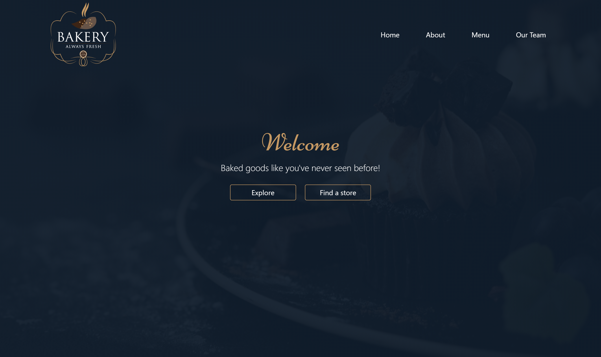
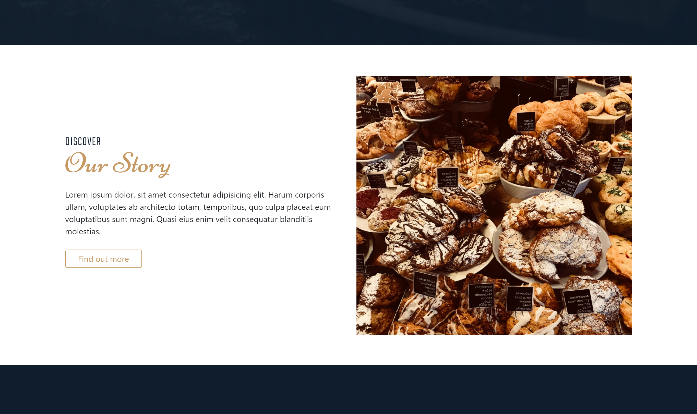
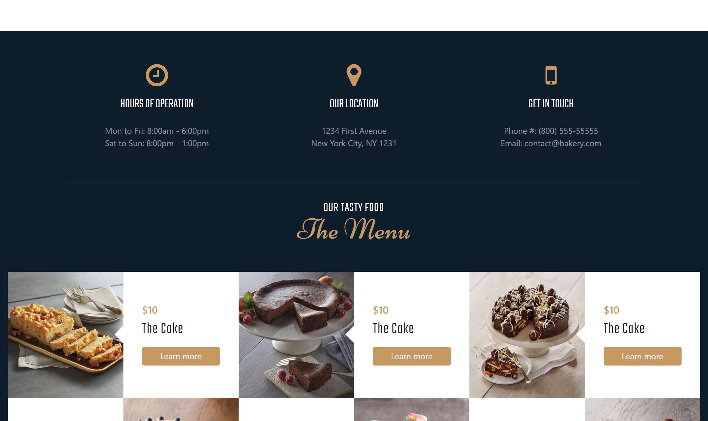
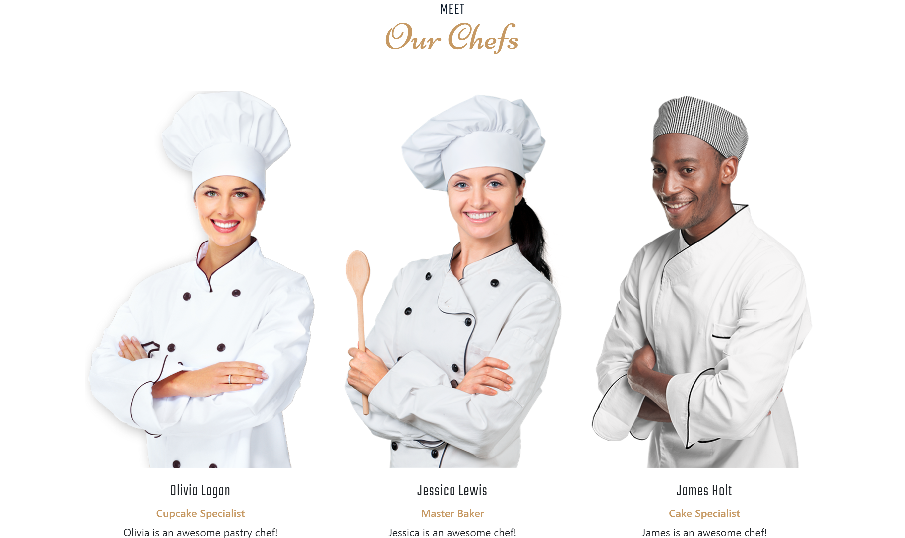
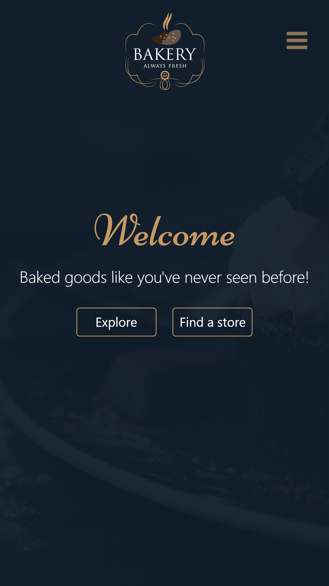
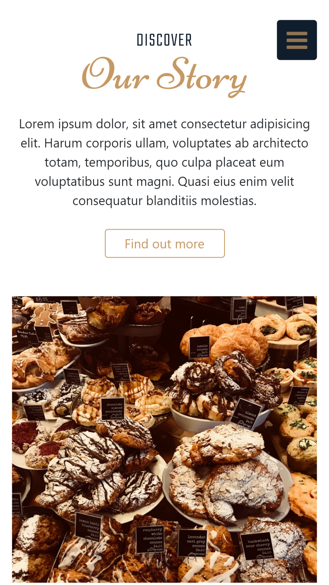
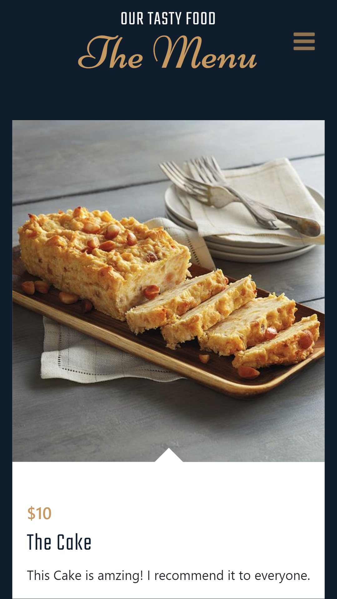

# Responsive Bakery
A responsive bakey site using Bootstrap and AOS (Animate on Scroll) library.
Click [here](https://thisis-Shitanshu.github.io/responsive-bakery-website), to visit the project.

# Screenshots
## #Desktop View

- The Landing Page

- About Section

- The Menu

- The Chef Section

## #Mobile View

- The Landing Page

- About Section

- The Menu

- The Chef Section

